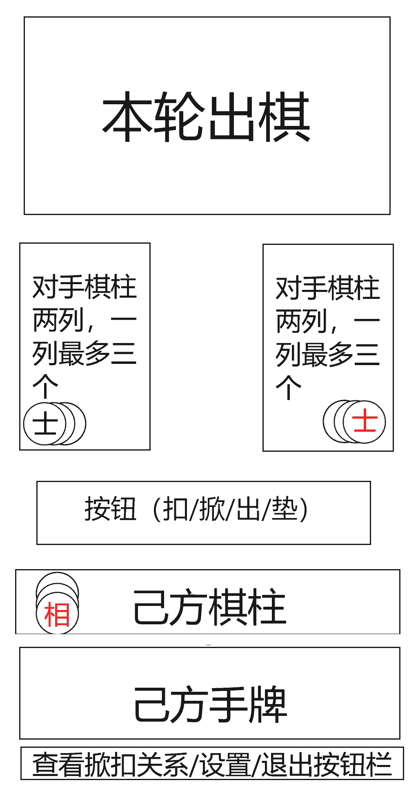
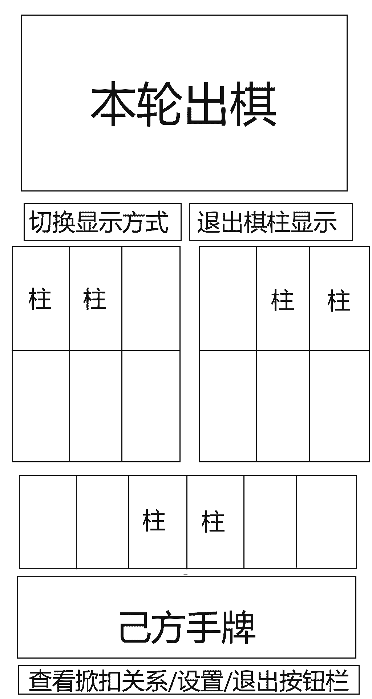
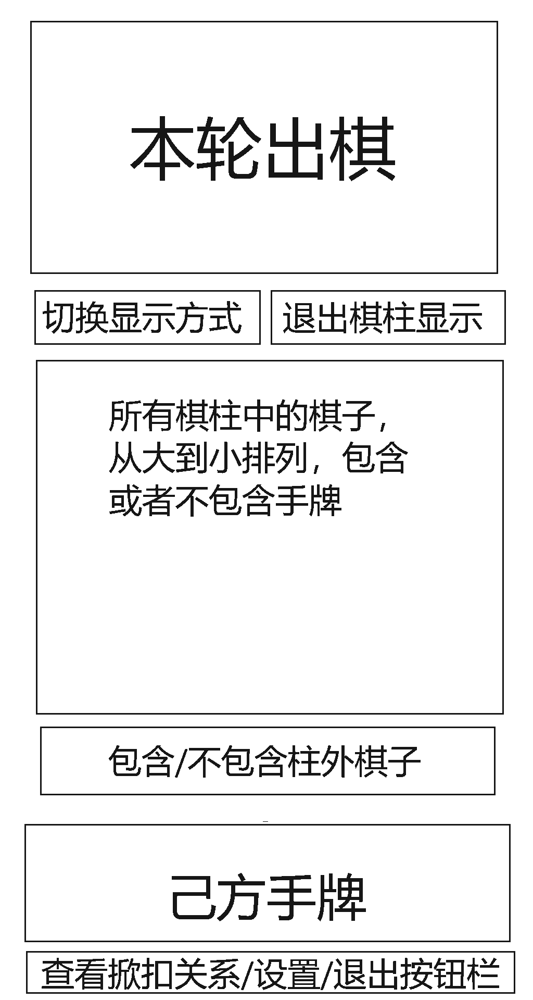

# 前端对局与结算设计文档（M8）

本文档用于指导 M8 前端实现：对局操作区、棋柱展示、掀扣关系查看与结算展示。

## 0. 范围与依赖
- 对齐文档：
  - `memory-bank/architecture.md`
  - `memory-bank/product-requirements.md`
  - `memory-bank/interfaces/frontend-backend-interfaces.md`
  - `memory-bank/interfaces/backend-engine-interface.md`
  - `memory-bank/implementation-plan.md`
- 本文档聚焦：
  - 对局阶段主界面与交互状态机
  - `legal_actions` 到操作 UI 的映射
  - 动作提交（`action_idx`、`cover_list`、`client_version`）与 409 恢复
  - 结算弹层与返回准备态
- 不覆盖：
  - 登录/大厅/房间基础链路（见 `memory-bank/design/frontend_design.md`）

## 1. 页面信息架构

### 1.1 对局主界面（默认视图）
示意图：`../assets/ingame_1.png`

布局从上到下：
- 本轮出棋状况区：按本轮动作顺序从左到右显示，每列上方显示出棋者箭头。己方垫棋牌面可见但样式需与普通出牌区分。
- 对手棋柱区：最多 2 列 * 3 行。每柱只完整展示最大牌，其余牌显示遮挡效果。
- 操作按钮区：按阶段动态显示 `BUCKLE` / `PASS_BUCKLE` / `REVEAL` / `PASS_REVEAL` / `PLAY` / `COVER`。`PLAY` 与 `COVER` 仅在已形成合法选择后可点击。
- 己方棋柱区：最多 6 柱，样式与对手区一致但遮挡方向相反。
- 手牌区：显示当前手牌。
- 底部工具区：`查看掀扣关系` / `设置` / `退出`。

交互入口：
- 点击任一玩家棋柱区域进入“棋柱显示界面”。

### 1.2 棋柱显示界面（按归属）
示意图：`../assets/ingame_2.png`

布局从上到下：
- 本轮出棋状况区（与主界面一致）。
- 视图切换与退出区（切换“按归属/按大小”，退出棋柱显示）。
- 棋柱展示区：
  - 左上：左侧对手（最多 2 行 * 3 列，共 6 柱），按从左到右、从上到下填充。
  - 右上：右侧对手（最多 2 行 * 3 列，共 6 柱），按从右到左、从上到下填充。
  - 下方：己方棋柱，居中显示。
  - 每柱三枚棋子全部展开显示，不使用遮挡。
  - 己方垫牌显示具体牌面，但样式需与普通出牌区分。
- 手牌区（与主界面一致）。
- 底部工具区（与主界面一致）。

### 1.3 棋柱显示界面（按大小）
示意图：`../assets/ingame_3.png`

布局从上到下：
- 本轮出棋状况区（与主界面一致）。
- 视图切换与退出区（与按归属视图一致）。
- 牌面排序区：
  - 汇总所有棋柱中的棋子（包含已扣棋），按牌力从大到小排列。
  - 最多 4 行，每行最多 6 张。
  - 己方垫牌可显示牌面且样式区分；对手垫牌仅显示数量并排在末尾。
- 范围切换按钮：切换“包含/不包含柱外牌（己方手牌、本轮出牌）”。
- 手牌区（与主界面一致）。
- 底部工具区（与主界面一致）。

## 2. 组件与状态模型

### 2.1 组件划分（建议）
- `InGamePage`
- `RoundPlaysStrip`
- `OpponentPillarGrid`
- `SelfPillarStrip`
- `ActionBar`
- `HandCardList`
- `PillarOverlay`（按归属 / 按大小）
- `RevealRelationModal`
- `SettlementModal`

### 2.2 前端状态切片（建议）
- `gamePublicState`：`game_id`、`public_state`
- `gamePrivateState`：`self_seat`、`private_state`
- `legalActionsState`：当前 seat 的 `legal_actions`
- `uiSelectionState`：手牌选中集合、当前视图模式、柱外牌包含开关
- `modalState`：掀扣关系弹层、结算弹层

## 3. 操作区与协议映射

### 3.1 按 `legal_actions` 驱动按钮展示
- 后端返回 `legal_actions.actions` 后，前端只按返回动作渲染可操作项，不自行推断额外动作。
- 动作映射：
  - `BUCKLE` -> 扣棋按钮
  - `PASS_BUCKLE` -> 不扣按钮
  - `REVEAL` -> 掀棋按钮
  - `PASS_REVEAL` -> 不掀按钮
  - `PLAY` -> 出棋流程
  - `COVER` -> 垫棋流程

### 3.2 提交约定
- 所有提交走 `POST /api/games/{game_id}/actions`。
- 请求体：
  - `action_idx`：`legal_actions.actions` 中下标。
  - `cover_list`：仅 `COVER` 传计数表；其他动作传 `null` 或省略。
  - `client_version`：取 `public_state.version`。
- 成功：204；随后由 WS 收到新状态并重建界面。

### 3.3 409 版本冲突恢复
- 当返回 `409 + GAME_VERSION_CONFLICT`：
  - 立即调用 `GET /api/games/{game_id}/state` 拉最新快照。
  - 用新 `public_state`、`private_state`、`legal_actions` 覆盖本地状态。
  - 清空当前手牌选择态与待提交动作。

## 4. 手牌交互状态机

### 4.1 三态定义
- 普通态：不可交互。
- 可合法交互态：可点击。
- 已选中态：当前提交候选。

### 4.2 通用规则
- 只有“可合法交互态”与“已选中态”允许点击。
- 点击可合法交互牌 -> 进入已选中态。
- 点击已选中牌 -> 取消选中并回退（具体回退规则见各场景）。

### 4.3 COVER（垫牌）场景
- 初始：所有手牌均可合法交互。
- 未达到 `required_count`：未选中牌保持可交互。
- 达到 `required_count`：
  - 其余未选中牌进入普通态。
  - 垫棋按钮可点击。
- 再次点击已选中牌：退回可合法交互态并重算按钮可用性。

### 4.4 PLAY（轮中非首位）场景
- 初始：展示所有可合法交互牌。
- 点击一张牌后，应收敛到唯一合法出法（来自 `PLAY.payload_cards`）。
- 一旦形成合法出法：
  - 该组合标记为已选中态。
  - 其他牌进入普通态。
  - 出棋按钮可点击。
- 点击已选中组合任一牌：取消本次选择并回到初始可选列表。

### 4.5 PLAY（轮中首位）场景
- 初始：所有可起手的牌可交互。
- 选中对子/三牛中的部分牌后：
  - 同组合剩余牌进入可合法交互态；
  - 其他牌进入普通态；
  - 当已满足某一合法 `payload_cards` 时，出棋按钮可点击。
- 再次点击已选中牌：从组合中移除该牌并重算可交互集合。

## 5. 棋柱与场面信息展示规则

### 5.1 出棋状况区
- 数据来源：`public_state.turn.plays`。
- 垫牌项（`power = -1`）在公共区只展示 `covered_count`；己方可从 `private_state.covered` 补足牌面信息用于本地显示。

### 5.2 棋柱区
- 数据来源：`public_state.pillar_groups`。
- 主界面使用“最大牌完整 + 其余遮挡”。
- 棋柱弹层使用“全展开”。
- 对手垫牌不得显示具体牌面。

### 5.3 按大小视图
- 公共牌按牌力降序排序。
- 对手垫牌仅数量化展示并固定在末尾。
- “包含柱外牌”开关仅影响本地展示集合，不改变服务端状态。

## 6. 掀扣关系弹层
- 入口：底部 `查看掀扣关系`。
- 数据来源：`public_state.reveal.relations`。
- 每条关系显示：
  - `revealer_seat -> buckler_seat`
  - 掀棋时是否已够（`revealer_enough_at_time`）
- 失效关系显示规则：
  - 文本置灰；
  - 添加中划线。
- 右上角关闭按钮仅关闭弹层，不影响对局状态。

## 7. 结算弹层
- 触发：收到 `SETTLEMENT` 消息或 `public_state.phase = settlement`。
- 展示：
  - 每位玩家总筹码变化 `delta`
  - 分项 `delta_enough`、`delta_reveal`、`delta_ceramic`
- 关闭行为：
  - 关闭弹层后回到房间等待态展示；
  - 前端提示“已进入准备阶段，请重新 ready 开新局”。

## 8. 异常与恢复
- WS 断连：沿用 M7 重连策略；重连成功后拉取 `GET /api/games/{game_id}/state` 兜底。
- 房间冷结束（`playing -> waiting` 且无 `SETTLEMENT`）：清空对局 UI，保留“对局结束”提示。
- 权限/状态错误（403/404/409）：显示统一错误消息并停止当前提交。

## 9. M8 验收清单（前端侧）
- 可按 `legal_actions` 正确渲染并提交六类动作。
- `COVER` 可按 `required_count` 形成合法 `cover_list`。
- 409 冲突可自动拉态恢复并继续操作。
- 对手私有信息不泄露（手牌与垫牌牌面不可见）。
- 掀扣关系与结算弹层可正确打开/关闭与展示。
- 结算关闭后回到准备态并可继续 ready。
